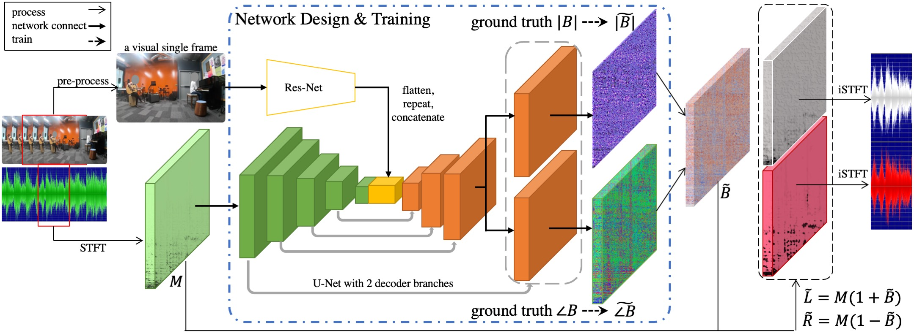

## Binaural Ratio
 

<br/>


### Training and Testing
(The code has been tested under the following system environment: Ubuntu 16.04.6 LTS, CUDA 9.0, Python 2.7.15, PyTorch 1.0.0)
1. Download the FAIR-Play (https://github.com/facebookresearch/FAIR-Play) dataset. 

2. Convert the mp4 clips into frames, and convert the binaural audios into mono audios by FFmpeg(https://FFmpeg.org/)

3. Use the following command to train the Phase-Mag Binaural model (Please note that in different epochs of validation and testing, the frames are not selected by uniform random from the 10s length clips, but from the fixed frames at the moment of the 5s):
```
python train.py --hdf5FolderPath /YOUR_CODE_PATH/2.5d_visual_sound/hdf5/ --name mono2binaural --model audioVisual --checkpoints_dir /YOUR_CHECKPOINT_PATH/ --save_epoch_freq 50 --display_freq 10 --save_latest_freq 100 --batchSize 256 --learning_rate_decrease_itr 10 --niter 1000 --lr_visual 0.0001 --lr_audio 0.001 --nThreads 32 --gpu_ids 0,1,2,3,4,5,6,7 --validation_on --validation_freq 100 --validation_batches 50 --tensorboard True |& tee -a mono2binaural.log
```
To train the simplified versions: Magnitude-Compensation Binaural Ratio and Vanilla Binaural Ratio: 

```bash
python trainMCOriginEval.py --unet_input_nc 2 --hdf5FolderPath YOUR_SPLIT_PATH/split1 --name MagCpstBR --model audioVisualMonoRatio --checkpoints_dir YOUR_CHECKPOINT_PATH --save_epoch_freq 50 --display_freq 1 --save_latest_freq 100 --batchSize 32 --learning_rate_decrease_itr 10 --niter 1000 --lr_visual 0.0001 --lr_audio 0.001 --nThreads 32 --gpu_ids 2,3 --validation_on --validation_batches 50 --validation_freq 50  |& tee -a MagCpstBR.log


python trainBROriginEval.py --unet_input_nc 2 --hdf5FolderPath YOUR_SPLIT_PATH/split1 --name VanillaBR --model audioVisualMonoRatio --checkpoints_dir YOUR_CHECKPOINT_PATH --save_epoch_freq 50 --display_freq 1 --save_latest_freq 100 --batchSize 32 --learning_rate_decrease_itr 10 --niter 1000 --lr_visual 0.0001 --lr_audio 0.001 --nThreads 32 --gpu_ids 0,1 --validation_on --validation_batches 50 --validation_freq 2 --validation_freq 50  |& tee -a VanillaBR.log
```
(need to find back the dMono_audioVisual_dataset.py later)
 

4. Use the following command to generate binaural audio in batches using your trained model:
```bash
bash batchDemoPM.sh
```
you can edit batchDemoPM.sh in following ways:
--M option (M,L,R) to choose channel as input in generation,
GENERATION_NUM how many audios to generate,
YOUR_CHECKPOINT_PATH for the model you trained,
PREFIX for the generated file prefix to distinguish generations of different models,
etc


5. Use the following command for evaluation:
```bash
python OnlyPMOriginEval.py --weights_audio YOUR_CHECKPOINT_PATH/audio_best.pth --weights_visual YOUR_CHECKPOINT_PATH/visual_best.pth --unet_input_nc 2 --hdf5FolderPath YOUR_SPLIT_PATH/split1 --name PhaseMagBR --model audioVisualMonoRatio --validation_on --validation_freq 50 --validation_batches 50 


python OnlyMCOriginEval.py --weights_audio YOUR_CHECKPOINT_PATH/audio_best.pth --weights_visual YOUR_CHECKPOINT_PATH/visual_best.pth --unet_input_nc 2 --hdf5FolderPath YOUR_SPLIT_PATH/split1 --name MagCpstBR --model audioVisualMonoRatio --validation_on --validation_freq 50 --validation_batches 50 


python OnlyBROriginEval.py --weights_audio YOUR_CHECKPOINT_PATH/audio_best.pth --weights_visual YOUR_CHECKPOINT_PATH/visual_best.pth --unet_input_nc 2 --hdf5FolderPath YOUR_SPLIT_PATH/split1 --name VanillaBR --model audioVisualMonoRatio --validation_on --validation_freq 50 --validation_batches 50 
```

### Acknowlegements
Portions of the code are adapted from the Mono2Binaural implementation (https://github.com/facebookresearch/2.5D-Visual-Sound) 


